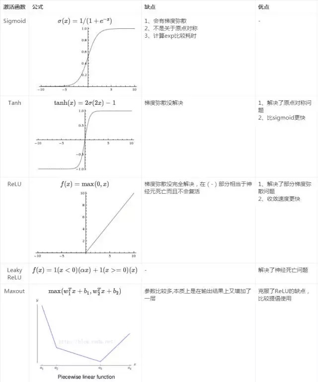

# 统计机器学习

## LR

### 概念

逻辑斯蒂回归：  

  $$p(y=1|x)=\cfrac{1}{1+exp(-z)}=\cfrac{exp(z)}{1+exp(z)}$$，$$p(y=0|x)=\cfrac{1}{1+exp(z)}$$

对数几率：$odds=log\cfrac{p}{1-p}$

在LR模型中，输出y=1的对数几率是输入x的线性函数

换一个角度看，通过sigmoid函数将线性函数$w*x$转换为概率

### 损失与参数估计

LR模型的损失函数是它的极大似然函数


这儿涉及到极大似然估计的一些知识

极大似然估计可以理解为一种参数估计的方法。利用已知样本，找到最有可能导致这些样本出现的模型参数即是所求参数，或者说什么样的参数能使得当前观测到的样本出现的概率最大。

$p(x|\theta)$  当$\theta$已知，x未知时，p叫做概率函数,它描述的是样本x出现的概率；当x已知，$\theta$未知时，叫似然函数，它描述的是对于不同的模型参数，出现x这个样本点的概率

**LR假设样本分布是伯努利分布，通过极大似然法,运用梯度下降方法来求解模型参数，达到二分类**。为方便求解，可对似然函数取log再加负号，即可转变成平时所见的LR的损失函数。李航书具体推导过程


### LR的基本假设，损失函数，求解方法

### 为什么用极大似然函数作为损失函数

极大似然函数取对数以后等同于对数损失函数，对对数损失函数的求解速度快，因为梯度为以下公式，可以发现梯度只和x，y有关，和sigmoid函数无关，更新速度快。一旦换平方损失就会使得梯度更新跟sigmoid有关，由于sigmoid梯度最多为0.25，会导致训练速度慢。


### 优点

- 形式简单，模型可解释性好
- 模型效果不错，特征工程可以并行开发，加快开发速度
- 训练速度快
- 占用资源少

### 缺点

- 准确率不够高
- 难以处理数据不平衡问题
- 难以处理非线性数据
- 无法筛特征

参考：

《统计学习方法》

[LR面试点总结](https://www.cnblogs.com/ModifyRong/p/7739955.html)


## SVM

### 概念

- 间隔最大化使得SVM有别于感知机
- 训练数据近似线性可分，可通过引入松弛因子软化间隔最大化，训练线性可分分类器
- 数据非线性，引入核技巧，在高维特征空间构建线性分类器

### 推导

- 线性可分推导：最大化几何间隔->拉格朗日对偶转换->求解极大极小问题
- 软间隔线性可分：引入松弛因子，损失多了松弛因子惩罚项，间隔为大于等于$1-\xi$ ,软间隔算出来的w，b同线性可分
- SVM也可以理解为优化带有L2正则的合页损失
- 核技巧：只定义核函数而不显示定义映射函数
- 序列最小化最优化算法：不断地将原二次规划问题分解为只含有两个变量的二次规划子问题，并对子问题进行解析求解，直到所有变量满足KKT条件。

### SVM为什么采用间隔最大化

当训练数据可分时候，有无穷多超平面能划分数据。感知机是通过最小化误差的策略来获得分离超平面的，不过感知机能得到无数个超平面。而SVM通过间隔最大化来获得最优分离超平面，这时候得到的解是唯一的。并且SVM得到的解只依赖少量的支持向量，分类结果鲁棒。

### 为什么转换成对偶问题

- 对偶问题更容易求解
- 自然引入核函数，进而推广到非线性分类问题

### 为什么引入核函数，以及常见核函数之间的区别

为了解决线性不可分的问题。在学习预测过程中不显示通过映射函数将样本映射到高维空间，而是通过核函数在低维空间来计算样本在高维空间的内积。因为特征空间维度可能很高，甚至是无穷维，所以直接计算映射后的样本内积是比较困难的。

常见核函数：

- 多项式核函数
- 高斯核函数
- 字符串核函数

RBF核主要用于线性不可分的情况，参数多，可通过交叉验证来寻参。如果feature较大，跟样本数差不多，可选用线性核。如果feature小于样本数，样本数也不是很多，可选用高斯核。其中高斯核中的$\sigma$参数影响着特征映射能力，$\sigma$越大，高次特征权重实际上衰减的很快，所以相当于得到一个低维空间；$\sigma$越小，映射的维度越高，任意数据线性可分，但意为这严重的过拟合。

### 常用的SVM实现库

- sklearn

主要可调参数

惩罚参数：C

kernel：核函数

degree：多项式核的维度

gamma：rbf、poly、sigmoid的核函数参数

- libsvm

### 为什么SVM对缺失数据敏感

SVM不能自动对缺失数据处理。SVM依赖样本在特征中线性可分，所以特征空间的好坏会影响SVM的性能。

### 如何转换成多分类问题

- 直接在目标函数上修改
- 对训练器进行组合，有一对一和一对多

### SVM为什么不用最小化平方误差函数MSE作为损失

- MSE的假设是高斯分布，而LR假设是伯努利分布
- MSE会导致损失是非凸的，导致出现很多局部最优解
- MSE损失配合sigmoid函数会出现梯度小，训练速度慢

### SVM为什么用hing loss

$Hinge\ loss=max(0,1-y(wx+b))$ 可以看出SVM使用合页损失要求分类不仅正确并且分类的置信度（函数间隔）足够大，这对模型的要求更高。

参考：

[SVM面试常考](https://blog.csdn.net/szlcw1/article/details/52259668)

[领扣总结](https://zhuanlan.zhihu.com/p/43827793?utm_source=ZHShareTargetIDMore&utm_medium=social&utm_oi=74838878191616)

[为什么不用MSE](http://www.cnblogs.com/maybe2030/p/9163479.html)

《统计学习方法》

## LR与SVM的联系与区别

#### 相同点

- 都是监督算法
- 都是线性分类方法
- 都是判别模型

#### 不同点

- 损失函数的不同

  LR是对数似然函数损失/交叉熵损失，而SVM是合页损失或者基于最大间隔策略来得到分离超平面。SVM只考虑支持向量而LR会考虑所有点，且LR受到数据分布本身的影响，如果数据分布不均，先要做数据均衡。

- SVM不能产生概率，LR可以

  如果要SVM输出概率，也可以在SVM基础上简历一个别的模型输出概率，还是转化为LR

- SVM知道结构风险最小化，LR是经验风险最小化

- LR和SVM在应用的区别

   对小规模数据，SVM可能效果更好。但是在大规模数据中，SVM的计算复杂度太高，而LR因为训练简单，可以在线训练且可解释性好所以被广泛应用。

参考：[SVM与LR的联系与区别](https://blog.csdn.net/haolexiao/article/details/70191667)

## 生成模型对比判别模型

判别模型直接生成一个表示$p(y|x)$的判别或者预测函数

生成模型先计算联合概率分布$p(y,x)$然后通过贝叶斯公式转化为条件概率。

SVM,LR,KNN,决策树都是判别模型，朴素贝叶斯，隐马尔可夫模型都是生成模型。

生成模型会尝试找到这个数据是怎么生成的，然后哪个类别最有可能生成该数据，那该样本就属于哪个类别。判别模型不关心样本的生成过程，只关心样本之间的差别，判别模型通过尽可能区分开不同类别的样本来分类。

## 决策树相关

### ID3

### 4.5

### CART

## 集成模型

### boosting

boosting集成侧重降低模型的偏差

#### adaboost

adaboost可以理解为加性模型，来最小化指数损失函数。该算法同过重赋权重法来改变数据的影响程度，使误分类的样本受到更多的关注


#### GBDT

#### XGBoost

### bagging

bagging侧重降低算法的方差

随机森林从两个角度来引入随机性：通过自助采样法（bootstrap sampling）训练多个分类器；随机属性选择（推荐为$log_{2}d$,其中d为全部属性数）。总结：样本扰动和属性扰动

## 缓解过拟合手段

1. **正则化**

   L1/L2正则的异同，how？why？推导过程、为何稀疏解和衰退解

   在回归任务重，引入L1正则的叫LASSO回归，引入L2正则的叫rige regression。

   根据奥卡姆剃刀原理，模型越简单越好。越复杂的模型越容易过拟合，如何降低模型的复杂度？正则化是很好的方式。

   正则项分为L1,L2。L1是参数绝对值之和，L2为参数平方之和。假设模型有两个参数w1和w2，那么可以画出模型损失的等高线，和正则项的等高线。

   

   

   

   可以显示看到，当模型想要向损失最小的点优化时候，模型的复杂度会升高（也就是正则项的值会变大）。所以正则项使得模型不会达到损失最小但会一定程度减少模型复杂度，提升泛化能力。

   

   **从数学推导解释L1产生稀疏解，L2产生绝对值偏小解原因**

   

   

   我们可以发现L1正则对权重的衰减一直一同样的力度，这样就会导致部分权重为0； L2正则会逐步衰减权重，权重越来越小的时候衰减也越来越弱，最后使得权重趋向于0.

   

   **从贝叶斯先验角度来看，把正则当做先验**

- L1 使模型参数服从**拉普拉斯分布**，对参数加了分布限制，大部分数值为0

- L2 使模型参数服从**高斯分布**，对参数加了分布限制，大部分绝对值很小

   参考：

   [正则化](https://charlesliuyx.github.io/2017/10/03/%E3%80%90%E7%9B%B4%E8%A7%82%E8%AF%A6%E8%A7%A3%E3%80%91%E4%BB%80%E4%B9%88%E6%98%AF%E6%AD%A3%E5%88%99%E5%8C%96/)

   西瓜书P253

   葫芦书P167

2. **dropout**

   网络中某些元素会以p的概率被设置失活，在BP过程中也不会更新该权重，且有1-p的概率被除以1-p作拉升。dropout训练过程随机失活起到正则效果，预测阶段起到bagging的融合效果。

3. **early stop**

4. **BN**

   深层网络中间层输出容易出现剧烈的变化，这种数值不稳定导致深度模型训练的困难。

   BN利用小批量上的均值和标准差不断调整网络中间输出，从而稳定网络中间层输出。

   第一步：计算均值和方差并标准化输入

   第二步：在标准化基础上乘上缩放因子加上偏移因子

   可学习的缩放因子和偏移因子保留了不做批量归一化的可能或者说因为经过第一步操作后，Normalization有可能降低神经网络的非线性表达能力，所以会以此方式来补偿Normalization操作后神经网络的表达能力。

   **卷积->BN->Relu**

   BN分训练模式和测试模式。常用方法是通过移动平均估算整个训练数据集的样本均值和方差，并在预测时使用它们得到确定的输出。

   BN计算的均值方差都是**特征维度**上的。在FC中，BN统计特征列的均值方差并标准化；在卷积网络中（N,C,H,W），我们需要对每个通道做BN，每个通道都拥有独立的缩放和偏移系数。设批数据有N个样本，我们需要对N\*H\*W个元素同时做批量归一化，这些元素同时减去均值和方差。

   可参考mxnet关于BN的简易实现

     

   参考[动手深度学习](http://zh.d2l.ai/chapter_convolutional-neural-networks/batch-norm.html?highlight=bn)

   关于后续各种normalization的改进版本可参考深度学习复习总结部分

   或者[深度学习中的normalization模型](https://zhuanlan.zhihu.com/p/43200897)

5. **数据增强**

   几何变换：旋转、缩放、裁剪、平移、填充、翻转等

   噪声扰动：椒盐/高斯噪声

   颜色扰动、随机擦除、mixup等

## 数据不均问题

1. 数据层面

   上采样、下采样、生成样本（SMOTE, ANASYN算法），GAN，Label Shuffle

2. 损失层面

   损失加权，改用合适的损失（如二分类分割用dice或者IOU损失）

3. 集成层面 bagging降低方差，boosting降低偏差

4. 问题转换

   当样本数目极其不均衡时，可转换为单类学习或者异常检测

5. 工程层面 做好交叉验证，设置好验证集

注：葫芦书在P195页专门探讨了该问题，那儿说的比较详细，这儿可能衍生出如何在不均衡数据集评估模型（AUC指标对数据分布不敏感，P-R曲线比较敏感，这儿也是参考葫芦书），不同处理方法的对比等


## 常见损失函数

### 分类损失

**交叉熵**：太经典了，不写了

**log loss**就是tf.losses.sigmoid_cross_entropy，二元交叉熵损失。该损失易遭受数据不均影响

**focal loss**：希望hard example对损失的贡献更大,kaiming一开始想通过$\alpha$来调节类别不均问题，但发现这样只能解决类别损失平衡问题，不能解决样本难以程度。故才有了$(1-p)^{\gamma}$这个动态调控难易样本损失的设计。当$\gamma=2$时，作者说p越大，这些容易的样本的loss贡献越小，如p=0.9时候，贡献的loss就会缩减100倍；而难样本，比如p=0.5，损失最多缩减了4倍。所以总的损失里，容易的样本的损失所占比重会小很多。总结：既能调整正负样本的权重，又能控制难易分类样本的权重。

$focal\ loss=-\alpha(1-p)^{\gamma}log(p)$


**Dice loss**：这个损失一般在二分类的分割任务中很好用，配合交叉熵


参考：

[语义分割loss详解与实现](https://blog.csdn.net/wangdongwei0/article/details/84576044)

**Lovasz-Softmax loss**：为IOU分割指标可优化的替代损失函数


作者表示该损失适用较大batchsize，且该损失适用于finetuning阶段。网友表示该损失与交叉熵加权结合效果比交叉熵效果要好。

**Triplet loss** 三元组损失


### 回归损失

### smooth L1

smooth L1使得L1在零点出可导从而使得函数更加平滑，这是通过一个差参数$\sigma$来控制平滑区域的，当$\sigma$很大时损失类似于L1范数损失，当它很小时，损失函数较平滑。


L1 不可导问题？

梯度下降法无法适用不可导处，此处可用坐标轴下降法。坐标轴下降法和梯度下降法具有相同的思想，都是沿着某个方向不断迭代，但是梯度下降法是沿着当前点的负梯度方向进行更新，而坐标轴下降法是沿着坐标轴的方向。

## 常见激活

sigmoid，ReLU，Tanh，Leaky ReLU，P ReLU, 




$\alpha$为很小的数，如0.01

而**P-ReLU**认为$\alpha$可作为一个参数来学习

**ELU**则融合了sigmoid和ReLU，左侧有软饱和性，右侧无饱和性。

$if x<0: f(x)=exp(x)-1$

$if x>=0: f(x)=x$

## 聚类算法

### kmeans

- 随机初始化类簇中心
- 对每个数据点，根据它与类簇中心的聚类打标签，然后根据新分类的点更新类簇中心
- 迭代以上步骤直到无明显变化


优点：速度快

缺点：需要人为设置类簇中心以及个数

### mean-shift(均值漂移)

均值漂移是一种基于滑动窗口的算法，根据滑窗内均值点作为新中心来不断更新滑窗使得滑窗朝着密度高的区域更新，直到无明显变化。其中该算法会同时用许多滑窗来更新，直到所有点均被滑过。当多个滑窗重叠时，保留包含点最多的窗口。根据数据点所在的滑窗来对数据归类。

- 随机初始化很多滑窗
- 根据滑窗包含的数据点来计算新中心，滑窗中心移到新中心
- 迭代上述步骤直到收敛


优点：可以自动发现类簇的数量而无需人工选择

缺点：滑窗大小需要指定

### DBSCAN（Density-Based Spatial Clustering of Applications with Noise）

DBSCAN是一种基于密度的聚类算法。

- 以任意未访问过得点开始，用$\epsilon$来表示领域距离，用minPoints表示领域内点的数量阈值
- 当该点领域内有足够多的的点(超过阈值)，那么开始聚类，将该点标记为新类簇的第一个点，否则标记为噪声点。
- 对于新类簇的第一个点，领域内的点也都归到同一个类，并对新加点的点重复上述流程，不断标记领域内点属于类簇还是噪声。
- 当对一个类簇操作完后，检索未访问的点，发现更多的类簇或者噪声。重复此过程，直到所有点都被访问过。


优点：不需要人为设置类簇数量，还能将异常值识别为噪声，它可以对任意形状和大小的类簇聚类

缺点: 当簇的密度不同时，DBSCAN不如其他聚类算法。领域距离阈值和数量阈值难以估计

### GMM

kmeans可以看做GMM的hard版本，GMM不光可以完成聚类，而且可以给出每个点属于类簇的概率，也就是说某个点可以由多个类簇组成，而不是像kmeans那样每个点只能属于某个类簇。GMM假设数据点服从高斯分布，这样我们可以用均值方差来描述一个类簇。

- 随机初始化类簇个数以及高斯分布的均值和方差
- 计算每个点属于每个类簇的概率，基于这些概率更新高斯分布参数使得该分布下出现这些点的概率最大。
- 迭代上述步骤，直到无明显变化


优势：GMM相比于kmean更加灵活。每个数据点可以以概率形式属于多个类簇

缺点：同kmeans，需要指定类簇个数和随机初始化高斯分布参数

### 凝聚层次聚类

自下而上的层次聚类算法也称为分层凝聚聚类算法，将每个数据点视为单个簇，然后不断合并成对的簇，直到所有簇合并成一个包含所有数据的簇。该簇的层次结构表示为树。

- 我们首先将每个数据点视为一个单一的簇，即如果我们的数据集中有X个数据点，则有X个簇。然后选择一个度量来确定两个簇之间的距离。使用平均连接（average linkage）作为例子来定义两个簇之间的距离，即第一个簇内的点与第二个簇内的点的平均距离。
- 在每次迭代中，我们将两个簇合并成一个簇。选出的两个簇为平均连接最小的簇。即根据我们选择的距离度量，这两个簇之间的距离最小，因此是最相似的，应该被合并起来。
- 重复步骤2直到我们到达树的根部，即我们只有一个包含所有数据点的簇。通过这种方式，我们可以在最后选择想要的簇数量，当只需选择何时停止簇的合并，即何时停止树的构建！

优势：分层聚类不要求我们指定类的数量，该算法对距离度量的选择不敏感，而其他算法对距离度量很敏感。

缺点：计算复杂度高，高达$O(n^{3})$，而kmeans和GMM为线性复杂度


参考：[五种聚类算法](https://mp.weixin.qq.com/s?__biz=MzI0MjY5NTM2MQ==&mid=2247486335&idx=1&sn=bc222debb4401ab42237298cbfbd8346&chksm=e97926d1de0eafc71fada73ac242f5e69d47503401203ec88fb7c310784f22dbdf2eb7ed0184&scene=38#wechat_redirect)

## 单机特征工程


### 数据预处理

标准化（作用于列，也就是特征，使之符合高斯分布）、归一化（作用于每个样本，使样本转换为单位向量）、二值化、亚编码、缺失值处理、多项式特征生成

### 特征选择

- filter：过滤法（方差、相关系数、卡方校验、互信息法）
- wrapper：包装法。根据目标函数（通常是预测效果评分），每次选择若干特征。如递归特征消除法
- embedded：嵌入法：先使用某种机器学习算法训练模型，得到各种特征的权重，再依据权重进行特征训练，类似filter，但是通过训练的模型来确定特征优劣性。如树模型，带L1正则的Lasso和带L2正则的Ridge

### 降维

PCA,LDA（线性判别分析）。其中PCA可依据最小重构误差和最大可分性（方差最大）两个角度解释，PCA属于无监督降维。LDA属于有监督降维，思路是使相同类别的样本投影距离尽可能近，不同类距离尽可能原，起到减少类内差，增大类间差的效果。

参考：[特征工程](https://www.cnblogs.com/jasonfreak/p/5448385.html)

# 编程语言

## python

### 深拷贝与浅拷贝的区别

python赋值都是将对象指向同一个内存地址

浅拷贝只会创建一个新的对象，并且对象内元素的地址指向同一个地址。若原对象改变可变类型元素(如list)，那么新赋值的对象也会随之而变。但原对象改变不可变类型(如string)，那么原对象因为改变内存指向，而新对象会指向原来的地址。

想要实现完全互不干扰，可以用深拷贝，深拷贝对于对象内的可变类型对象会新建一块内存，并将元素值一一复制过去，这样新对象和原对象之间互不干扰。

## C++

## 指针与引用的区别

指针：指针是一个变量，存储的是一个地址，指向内存的一个单元

引用：变量的别名，与原变量指向同一个内存

```c++
int a=1;int *p=&a;
int a=1;int &b=a;
```

## 虚函数与纯虚函数

定义虚函数是允许基类的指针能够调用子类的这个函数，虚函数可以在基类有实现。用virtual指定

定义一个函数为纯虚函数，代表该函数未被实现，需要继承实现，基类相当于定义了一个接口。

定义为virtual void function()=0

他们的引入都是为了实现多态特性。


# OS

## 进程与线程区别

## 为什么要四次挥手