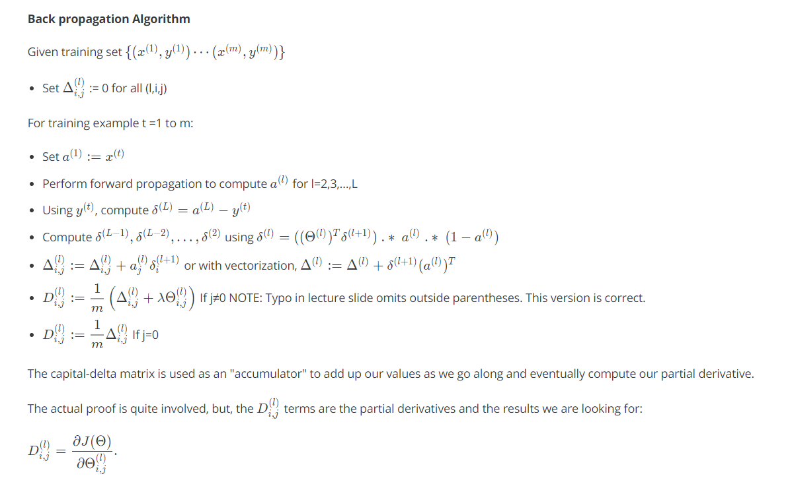
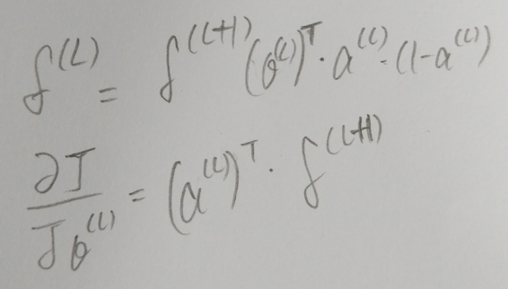
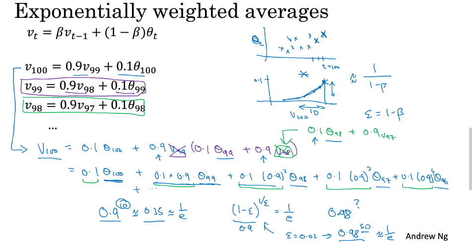
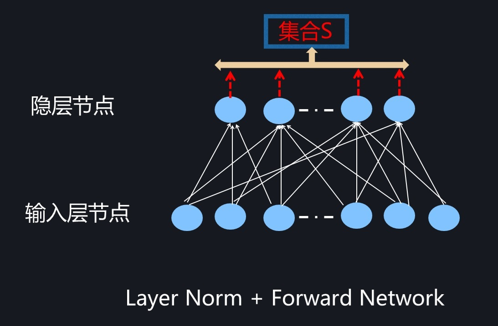
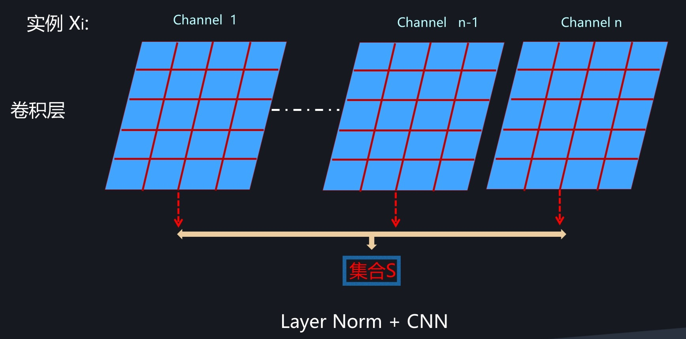
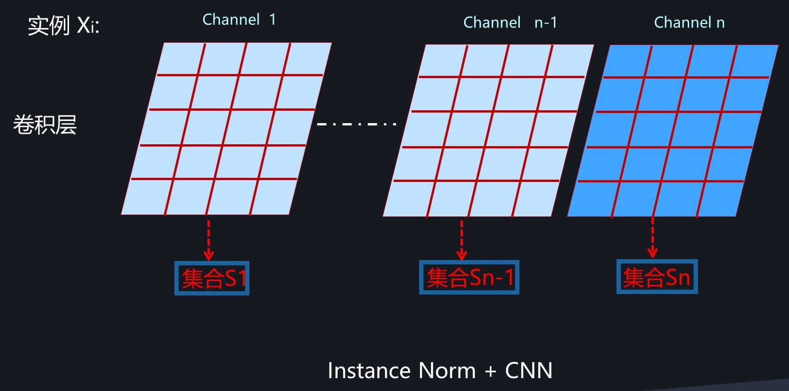
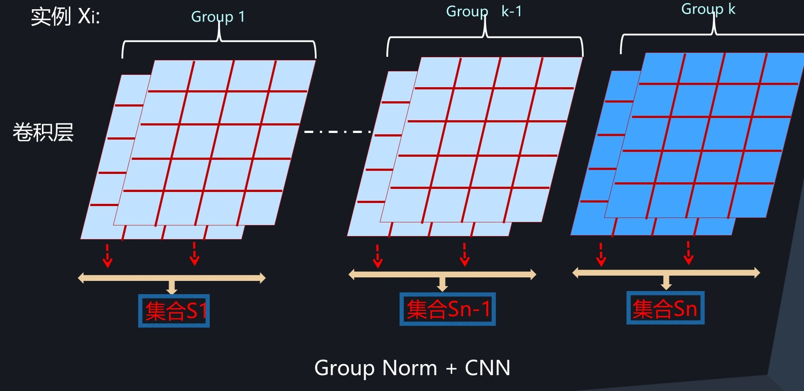
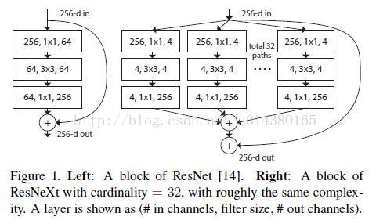
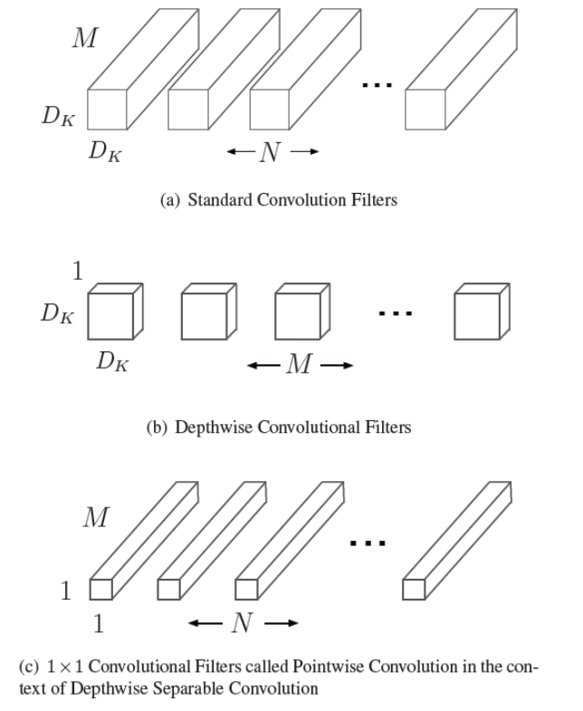
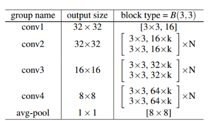

# 深度学习基础知识

## BP算法

参考印象笔记《反向传播理解》

上图为NG讲的BP算法，只不是上图是按照单个实例来计算的，要是按照批量数据的话，$\delta$和梯度的更新为下图。BP算法其实很好记，数据维度来辅助记忆就行。例如L层有两个结点，则$\delta^{L}$为$m\times2$,L+1层有3个结点，则$\delta^{L+1}$为$m\times3$.$\theta_{L}$为$\R^{2\times3}$，下面根据矩阵维度来辅助推导公式就行啦。

## 优化算法

### 指数加权（移动）平均

**Exponentially Weighted (moving) average** 本质上是一种近似求平均的方法。

例如$\theta_{t}$代表第t天的温度，$v_{t}$代表第t天的平均温度。指数加权平均对t个样本以一定权重累积求和而得，其中样本权重以指数衰减方式递减，距离当前数值越远的数值的权重越低，指数加权平均近似于$\frac{1}{1-\beta}$个数值的平均值，其中$\beta$ 系数越大，类似滑动的窗口越大，也就是平滑的效果越强，因为计算平均所用的样本多（或者之前样本的权重较大）。

### 基于动量的优化

基于动量的优化方式使得当前参数更新的方向不仅只看梯度的方向，还考虑到了之前的梯度方向，这儿使得梯度方向更新具有惯性。这儿动量优化使用的技术类似于指数加权平均，分别先计算当前mini batch的梯度$d_{w}$，然后加上之前梯度的指数衰减，用总梯度来更新当前参数。（这儿NG说自己更喜欢在$d_{w}$前面乘$1-\beta$）

参考：

NG deeplearning

[通俗理解指数加权平均](https://zhuanlan.zhihu.com/p/29895933)

### RMSProp

PMSProp由Hiton提出，体现出环境感知的能力，PMSProp能够自适应调整学习率。同样的我们想要在指向最优解的方向更大的更新力度更大，在非最优梯度方向更新力度小一点,NG这儿是利用w,b两个参数的方向来举例的，我们想要在w方向更新更快点，b方向更小点。为了达成这个目的，PMSProp使用了梯度的平方（二阶矩）信息，同样的基本思想是结合之前的梯度平方信息来平滑当前梯度。不同于动量方法有两点，第一点是PMSProp这儿累积的是梯度平方（二阶矩信息），而动量方法累积的是梯度(一阶矩)信息；第二点是RMSProp能够自适应调整学习率

### Adam

Adam是基于动量和PMSProp两种优化算法的结合版，Adam通过记录梯度的一阶矩，也就是过往梯度和当前梯度的平均，这体现了惯性的保持；Adam还记录了二阶矩，过往梯度的平方和当前梯度的平方的平均，这体现了环境感知；Adam也能像RMSProp那样自适应调整学习率。Adam有三个参数需要调节，学习率，还有$\beta1和\beta2$，其中$\beta1$一般设置为0.9，$\beta2$一般设置为0.999。注意Adam中对指数加权平均的偏智作了修正。

参考：

NG的DeepLearning.AI

葫芦书P161页关于优化算法的介绍

[深度学习优化算法总结](https://blog.csdn.net/qq_28031525/article/details/79535942)

## 网络感受野、参数量计算方式

## 为什么用卷积层

1)全连接参数太多且易过拟合； 2）卷积的局部连接，共享参数使得参数量大大减少

## 1*1卷积

相当于对每个空间位置的D维向量做了一个线性变换。通常用于增加非线性或者降维，减少参数

## 卷积结果的分布式表示

多对多概念，神经元参与到不同特征表示，特征也由不同神经元组成

## 常见初始化

xavier-uniform初始化

$randn(in,out)*\sqrt{6/(in+out)}​$

xavier-normal初始化

$randn(in,out)*\sqrt{2/(in+out)}$

He-uniform初始化

$randn(in,out)*\sqrt{6/in}$

He-normal初始化

$randn(in,out)*\sqrt{2/in}$

### 反卷积、上采样、反池化

这三种都可以实现特征图放大，但是实现的方式略有不同

##  各种normalization的区别？

batch，layer，instance**,**group normalization

### Batch Normalization

BN的提出在于解决深度网络训练过程中中间层数值不稳定导致深度网络难以有效训练的问题。优点：

- 加速模型收敛
- 模型不再依赖精细的参数初始化过程
- 学习率可以适当调大一点
- 适当引入了正则化的作用
- 增强泛化能力

BN的思想是在通过批量数据计算激活层的均值方差来做标准化操作来标准化激活神经元分布，并通过可学习的缩放因子和偏移因子来缓解因为归一化所造成的表征能力。总的来说BN是对每个特征维度对标准化操作，使用移动平均来近似数据集的全局均值与方差，测试时候直接使用移动均值与方差。（这儿再细致说一下，在全连接层BN直接统计每个维度特征的统计值来归一化；在卷积网络中，将每个通道看作一个特征维度，统计批量数据在每个通道上激活的统计值，故每个通道维护单独的一份缩放因子、偏移因子与移动平均）在分类等任务中取得了优异的表现，但是BN有几大缺陷：

- batch size太小会导致性能下降
- 对于像素级生成型任务，BN效果不佳（可能是mini-batch内内容无关的样本在特征维度归一化后会弱化单个样本内的细节特征）
- 训练与推断时候统计量不一致

后面出现了几种BN的改进版，他们都抛弃使用mini-batch数据来计算统计值，获取计算统计值的神经元的角度也各不相同，但本质都是从不同角度计算统计值来做归一化。

### Layer Normalization

Layer normalization的思路是直接计算单个实例所有当前层激活神经元的统计值来做归一化，在fc层就直接计算特征之间的统计信息，而卷积层就计算c个通道所有神经元的统计值；

### Instance Normalization

instance normalization只能作用与卷积特征图上，该方法计算单个通道内神经元的统计值来归一化

**instance normalization在图像生成类型的任务上要比BN要效果好**

### Group Normalization

Layer normalization和instance normalization都比较极端，而Group normalization稍微中和了一下两者。通道分组在CNN中较为常见，Group normalization自然就是先对所有通道分组，然后在分组内计算统计值归一化。

**Grouo normalization在batch size比较小或者目标检测/视频分类等应用场景下效果优于BN**

可以看出，所有模型都采取了类似的步骤和过程，将神经元的激活值重整为均值为0方差为1的新数值，最大的不同在于计算统计量的神经元集合S的划分方法上。BN采用了同一个神经元，但是来自于Mini-Batch中不同训练实例导致的不同激活作为统计范围。而为了克服Mini-Batch带来的弊端，后续改进方法抛弃了Mini-Batch的思路，只用当前训练实例引发的激活来划分集合S的统计范围，概括而言，LayerNorm采用同隐层的所有神经元；InstanceNorm采用CNN中卷积层的单个通道作为统计范围，而GroupNorm则折衷两者，采用卷积层的通道分组，在划分为同一个分组的通道内来作为通道范围。

至于各种Normalization的适用场景，可以简洁归纳如下：对于RNN的神经网络结构来说，目前只有LayerNorm是相对有效的；如果是GAN等图片生成或图片内容改写类型的任务，可以优先尝试InstanceNorm；如果使用场景约束BatchSize必须设置很小，无疑此时考虑使用GroupNorm；而其它任务情形应该优先考虑使用BatchNorm。

参考：[深度学习中各种normalization模型](https://zhuanlan.zhihu.com/p/43200897)

# 深度学习计算机视觉

## 分类网络（优缺点分析）

### LeNet-5

支票手写数字识别。网络基本架构为：conv1 (6) -> pool1 -> conv2 (16) -> pool2 -> fc3 (120) -> fc4 (84) -> fc5 (10) -> softmax

### AlexNet

imagenet2012冠军网络。结构类似LeNet-5

特点：（1）使用大尺度卷积核，使用ReLU激活  （2）使用dropout  （3）大量数据增强手段

### VGG-16/19

（1）结构简单，只有3\*3卷积与2\*2池化,重复堆叠相同模块，相同感受野下所需参数更少

### GoogLeNet

2014年冠军，提出Inception模块 （1）多尺度并行分支结构 （增加网络宽度，增强网络对尺度的适应性）（2）使用1*1卷积降低参数量 （3）使用全局平均替换全连接层

### Inception v2/3/4

v2/v3/v4 在GoogLeNet基础上进一步进一步降低参数量，（1）大卷机核替换为小卷积的叠加（2）卷积分解（3）V3使用了BN （4）V4引入残差设计 (5) 使用到标签平滑（一定程度防止过拟合）

### Xception

Xception是Inception v3的改进版本，改进主要体现在depthwise separable convolution的引入。在Inception模块中并行的分支都通过1\*1的卷积来降维，作者简化Inception模块就得到Fig3的结构，先统一1\*1卷积，然后再将卷积后的结果均分给3\*3的卷积去提特征，后来作者再次提出极致版Inception模块，那就是对输入先统一1\*1组合特征，然后每个1\*1卷积结果后面都跟一个3\*3的卷积去提取特征。这儿作者提到的结构就和深度可分卷积类似了。

正常的卷积流程如（a）所示，深度可分卷积的流程分两步：第一步逐特征图卷积（如图b）；第二步，通过N个1\*1卷积组合之前得到的M个特征图生成N个特征图

最后上图就是Xception最终的网络结构图，Xception作为Inception v3的改进，通过引入depthwise separable convocation在基本不增加模型复杂度的情况下提升模型性能。

### ResNet

旨在解决难以训练很深网络的问题，残差设计有效缓解反向传播由于网络太深导致的梯度消失问题。此外，resnet也可以看作为许多不同深度而共享参数的网络集成。（1）残差连接，容易训练更深网络（2）大量使用BN（3）对于很深的网络，使用瓶颈（bottleneck）结构

### preResNet

调整残差模块中各层的顺序，直接将残差分支的结果加到原始输入作为当前残差模块的输出，这使得上下层之间的信息更加流畅。

### ResNeXt

受到Inception模块启发，ResNeXt将残差分支变为多个并行分支，不同于Inception不同大小的分支，ResNeXt所有并行分支都相同，最后输出为所有并行分支之和。（1）沿用ResNet的残差连接（2）残差分支采用多分支并行设计（3）采用1*1卷积降低参数量

### DenseNet

不同于ResNet的残差设计，DenseNet任意两两层之间都有连接，这使得当前层的输入来自于之前所有层的输出，融合了低层和高层的特征信息。DenseNet中卷基层的滤波器数较少，总的来说DenseNet获取与ResNet相同的性能所需的参数更少。

优点：

- 减轻梯度消失
- 加强feature传递，更加高效利用feature
- 一定程度减少参数量，也一定减少过拟合

### SENet

2017年imagenet冠军，SENet使用额外分支来调控每个通道特征图的权重

参考：

[计算机视觉四大基本任务](https://zhuanlan.zhihu.com/p/31727402)

### MobileNet

深度可分卷积，参数量降低到接近原来的1/9

### wide ResNet

关键点：增大卷积输出，增加输出宽度/厚度，同时使得网络不太深

其中k为输出通道缩放因子，WRN-28-10就代表网络一共28层，k为10

特点：获取与原ResNet接近或者更好性能时所需的参数量更少

## 分割网络

### FCN

FCN乃深度语义的开山鼻祖，（1）全脸阶层换成了卷基层 （2）不同尺度的信息融合FCN-8S,FCN-32S

FCN在1/32特征图上先直接预测分割结果，然后将结果放大后与1/16的特征图做逐元素相加，将相加后的结果再次放大与1/8的特诊图相加来得到1/8大小的预测分割图，上采样8倍求loss。

### U-Net

这个太熟悉了，编码-解码结构，跳层连接，级联特征

### SegNet

SegNet也是编码-解码结构，但区别在于SegNet没有直接将编码层的特征级联到解码层，而是在编码层池化的时候记录最大像素值的位置，在解码层将反池化的时候将对象像素值恢复到原来记录的位置，其他位置补零，这样一定程度恢复了细节信息。此外，这样的操作所需的计算量更少。

### RefineNet

RefineNet网络是个U型的结构，左边是编码层，右边RefinNet block的作用就是融合不同尺度的feature map。

### PSPNet

**Pyramid Scene Parsing Network（PSPNet）CVPR2017**的文章，这篇文章的出发点是引入更多的上下文信息（context information）来减少误分割。引入多尺度上下文信息的是空间金字塔池化结构，该结构通过对输入的特征图进行不同参数的池化得到不同大小的特征图以得到不同感受野上下文的特征，最后将这些不同感受野的特征resize到一样大级联输入进来的特征图作为输出。这儿就完成了不同尺度上下文信息的融合与浅层与深层特征的融合。从源码来看，作者使用了带空洞卷积的Res101作为backbone，空间金字塔池化后的四个特征图大小分别为1,2,3,6。其中在空间金字塔池化前作者还引入了一个辅助分割损失，就是直接输出分割，辅助后面的分割。可参考pytorch-semantic-segmentation-master中源码

### Large Kernel Matters

Improve Semantic Segmentation by Global Convolutional Network

提出一种带有大维度卷积核的编码-解码结构，通过全局卷积网络来提升语义分割效果。

语义分割其实是两个任务：定位与分类。分类需要平移旋转不变性，而定位则对位置信息很敏感。那么GCN结构在这两个任务之间找到平衡。使用大内核使得特征图之间有密集连接，优化分类性能，大内核也提供了很大的语义上下文信息也有助于分割任务。

### DeepLab系列

**DeepLab v1**很直接，（1）通过带孔卷积实现扩张感受野； （2）加入CRF，利用像素间的关系，相邻的像素或者颜色相近的像素更有可能属于同一个类。

**DeepLab v2** 的改进之处在于引入了ASPP（atrous spatial pyramid pooling）空洞金字塔池化模块，该模块通过并行的四个带孔卷积捕捉不同尺度的感受野，最后级联起来起到融合不同感受野（感知上下文信息）。此外为了避免池化造成的尺度损失，v2通过空洞卷积来增大感受野。同样采样CRF增强模型捕捉细节的能力。

**DeepLab v3**

（1）改进了ASPP模块：加入了BN层，加入了全局池化，加强全局特征

在旧的ASPP模块中，本来以为只要空洞卷积的扩张率足够大就能获取全局特征信息，但是当扩张率很大的时候，卷积核真正与特征图点乘的位置很少，大多与填充的0做点成，这就导致无法有效捕捉全局特征信息。为了加强全局特征信息，引入全局池化。

（2）引入残差模块  其中改进的Res后面的卷积使用的空洞卷积，也是为了过得更大感受野而不损失特征尺度

（3）丢弃CRF

**DeepLab v3+**

DeepLab v3的改进不是很多，可以看出v3+也开始融合浅层的特征了，这就又有点像U型结构了。总来的看，v3+将原来的v3看成编码器，然后上采样和浅层的特征级联作为特征图预测分割结果，利用浅层特征显然是像利用浅层特征更加丰富的空间信息。

此外，编码器部分加入了Xception结构，减少了参数量，提高运行速度。

总结：

- FCN作为深度卷积分割的开山之作，奠定了多尺度特征图融合的基本架构。后期的U-Net，SegNet都是采用了编码解码结构，像PSPNet和DeepLab v3+虽然不能完全是U型，但也通过融合不同尺度的特征图来增强分割性能。
- 为了使得预测结果包含更多的上下文或者不同感受野的特征信息来指导分割的话，PSPNet和DeepLab v3均采用了并行结构获取不同尺度特征图。
- 空洞卷积是个扩张感受野而不损失特征图大小的好东西
- 转置卷积易产生网格效应，简单的上采样resize操作实践中挺好用
- 分割条件允许下，图越大越好
- 分割特定类别，可以考虑引入先验信息+对结果进行形态学处理

参考：

[语义分割综述](https://zhuanlan.zhihu.com/p/37618829)

[PSPNet算法笔记](https://blog.csdn.net/u014380165/article/details/83869175)

## RNN

### LSTM

LSTM通过三个门来更新cell state

遗忘门：

先计算哪些信息被保留哪些被丢弃

输入门：

决定哪些信息被加入到cell state

通过遗忘门和输入门来更新cell state

输出门：

决定cell state中哪些信息被输出

### LSTM为什么能解决梯度消失问题

## 目标检测

### YOLO

### SSD

### RCNN系列

# 传统计算机视觉

# 编程语言

## python深拷贝与浅拷贝的理解

## 智能指针

## 引用与指针的理解

## 

