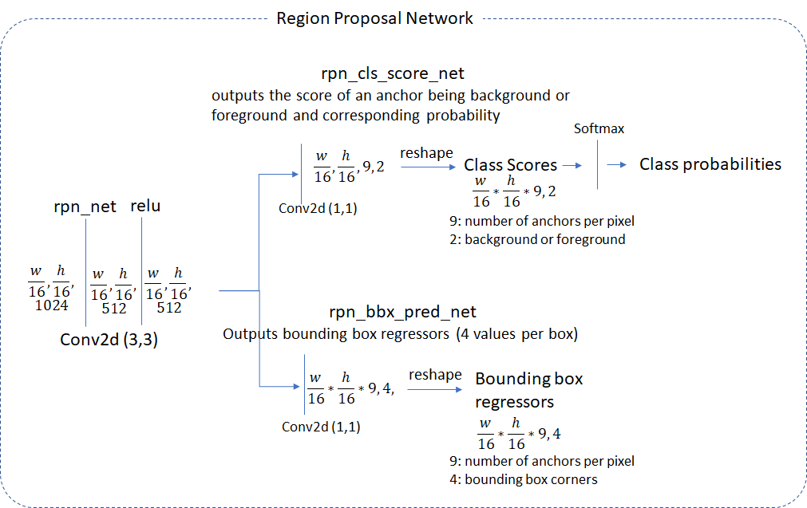

# Faster RCNN算法解析

本文主要是对该[博客](<http://www.telesens.co/2018/03/11/object-detection-and-classification-using-r-cnns/#ResNet_50_Network_Architecture>)进行一个总结，这篇博客也是参考该[代码](https://github.com/ruotianluo/pytorch-faster-rcnn)实现的faster rcnn来讲解。本文从图像预处理，网络结构，训练阶段和测试阶段几个方面来阐述实现的思路。

##  图像预处理

预处理 

- 归一化

- 缩放

  将图像的短边缩放到targetsize，同时保证图像的最长边不超过maxsize。默认的targetsize为600，maxsize为1000.

## 网络结构

R-CNN系列工作分为两个阶段。第一阶段找到ROI,也就是可能含有目标的区域；第二阶段对ROI进行分类和边框回归预测

Faster-RCNN算法分为以下三个步骤

- 特征抽取（head）
- RPN网络
- 分类回归网络（classification network）

head为ResNet50的前三个layer，将抽出的特征送到RPN网络，RPN网络负责找到可能的ROI区域并且给出区域的位置，ROI由于大小不一，所以还需要经过ROI Pooling或者ROI Align操作统一尺度，最后将统一大小的ROI区域再送到分类回归网络去判别每个ROI所属类别与正样本的边框位置与大小。

## 训练实现细节

### 边框回归系数

在RPN和最终的分类回归网络需要对边框的左上角位置坐标和边框大小进行回归修正边框位置。在Faster RCNN中并不是直接回归位置坐标和边框大小，而是回归预测与目标之间的比例系数。如上图所示，用$O_{x},O_{y},O_{h},O_{w}$分别表示预测框的左上角位置和边框的高宽，T来表示目标位置和宽高。位置与宽高比例的预测计算方式还不同，但为什么是预测这样计算的比例而不是别的呢？这儿主要是为了保证仿射变换不变形（这儿的反射变换指平移和缩放）。如上图右图所示，当对图像平移$d_{x}d_{y}$，缩放$s_{x}s_{y}$的时候，边框左上角的坐标和图片的宽高都变了，但是回归的比例系数t保持不变。

### 中间核心层

上图显示了经过特征抽取后，faster rcnn如何生成ROI并且如何对ROI做分类与回归的。

- 首先faster rcnn是基于anchor机制的，在generator layer负责生成anchor，每个像素点9个anchor。
- proposal layer预测每个anchor的类别和边框回归并且用NMS来抑制冗余边框。
- 在训练阶段，还需要anchor target layer给anchor打标签。其中类别只打正负标签，边框是比例系数。将那些与标签框的IOU大于一定阈值的anchor设置为由目标的正样本，将IOU小于一定阈值的设置为负样本。在训练阶段需要训练RPN网络，使用分类和回归损失。
- proposal target loss 层主要是用来再次挑选从proposal layer预测出来的有目标的框（ROI），并且给那些ROI打上标签，类别标签和边框标签（其中边框标签是逐类别给出的，也就是说边框回归输出的维度为number_class*4）。
- ROI pooling layer是用来将ROI池化为固定大小的特征，这儿作者使用的插值方式，应该类似RoIAlian。faster rcnn还有RoI Pooling。其中这儿pooling或者align都是对原ROI的一种采样，我理解为一种缩放方式，前面提到边框我们回归的是比例系数，故还可以用原来的比例系数作为池化后ROI的target。（这儿需要确认是否理解有偏差）
- classification layer主要是对ROI pooling输出的ROI提取特征然后预测类别与边框比例系数。

### RPN

### proposal layer

该层主要负责通过RPN生成的anchor类别与边框比例系数来调整anchor，并找出有可能含有目标的区域，并且对找出来的区域进行NMS。上图画的很详细了，输入为生成的anchor和RPN的输出，输出为找到的ROI和ROI分数。

### RPN loss

RPN的损失分两个部分，第一部分为分类损失，二元交叉熵损失，回归损失为smooth L1。

### Anchor Target layer

该层用来给生成的anchor打标签。生成的anchor很多，我们只给部分anchor打上正负样本的标签。将两种anchor打上正样本标签

- type A：对于每一个GT box，与之有最大IOU的anchor设置为正样本
- type B：将所有与GT box的IOU超过一定阈值的anchor设置为正样本

其中我们会设置正负样本总数的阈值和正样本比例的阈值，当正样本比例超过阈值，要丢弃掉超过的部分。

这儿给出anchor tatget layer的参数

剩余的proposal target layer， ROI pooling layer 和classification layer是用来生成去计算分类回归损失所需要的信息。

先分析最后的分类回归层

### classification layer loss

和RPN loss类似，最后的损失层也是有分类和回归损失构成。分类为多分类交叉熵损失，回归损失仅计算预测为正样本的回归损失。

### proposal target layer

为了去算最后的分类回归损失，我们肯定需要知道RPN网络输出的ROI的类别和边框比例系数，proposal target layer就是干这个的。proposal target layer从proposal layer输出的正样本中选择有可能的ROI作为正样本。和anchor target layer类似，我们需要选择好的proposals（与GT box有一定重合比例的ROI）来算损失，不然很难学习。

算从proposal layer得出的ROI与GT box的IOU,根据ROI与GT box的IOU来给ROI打标签。其中那些与GT box的IOU超过一定阈值（默认0.5）的ROI被设置为正样本，介于0.1-0.5之间的ROI被认为是负样本，这也是hard negative example的体现。

同时，需要确保正负样本总数恒定，如果负样本太少了，就随机复制一些来弥补空缺。

目标框是由与GT Box的IOU最大ROI来确定，并且回归框系数是逐类别的。

上图给出了生成的ROI target格式，bbox_inside_weights可以理解为掩膜

关于上图，我有点疑惑。faster rcnn每个ROI也就预测一个类别，那么说一个ROI对应一个预测目标，也就是说只需要预测一个框的信息（四个值），上图怎么搞得想要由一个ROI预测多个目标，这也不对，类别是由softmax算的类别概率，不可能是多类别啊，那么这儿我觉得完全没必要搞这么复杂啊。

该层的输入输出，感觉输出上少了类别

### Crop Pooling

说实话，该层我的理解是ROI pooling或者ROI align。关于ROI pooling和ROI align的区别主要是池化位置信息的准确程度。ROI pooling会造成量化损失，不利于小目标框预测，在mask rcnn就是用align，align通过插值的方式算出池化后的值，没有引入量化的损失，导致更加准确的位置信息。需要对小目标优化，align更优。

原博文中这一节作者应该也是将插值池化的方法，他写的解释我有些没看明白，可能是作者提出的某种采样算法，但作者提到这儿是直接采用的pytorch已有的API，这儿而还需要再了解下。

### classification layer

在RPN和最后的classification layer都进行了分类和回归预测，但两者也略有区别。

在RPN中，分类是二分类，回归的是与GT box最接近的anchor的位置、大小。RPN的作用就是找到含有目标的区域并且修正有目标区域anchor的位置和大小。作者在博客中说很难确定RPN网络学习是如何进行的，但RPN能够将特征解释成更好的边框位置和大小。

在最后的classification layer中分类是多类别分类，回归的每个ROI每个类别的边框比例。注意到，该层接收的特征是经过ROI pooling之后得到的方形的ROI，但是我们仍可以用原来的比例系数，那是因为我们回归的比例系数是有仿射变换不变性。

## 推断实现细节

## 附录

### NMS

Non-maximum suppression（NMS）的本质是搜索局部极大值，抑制非极大值元素。

遍历每个类别，找到当前类别预测分值最高的框B（搜索局部极大值），然后删除同类别下与B的IOU超过一定阈值的框（抑制过程）

