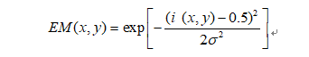
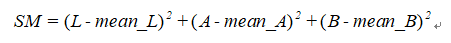
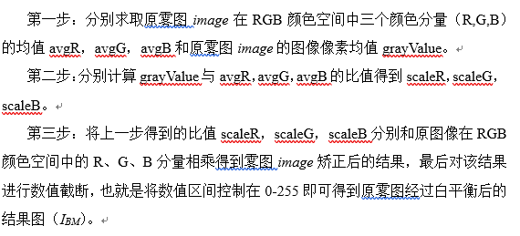
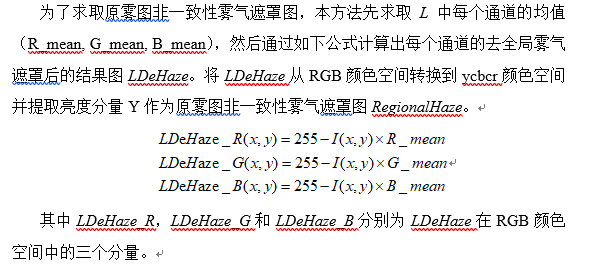

# 青光眼筛查项目

## 项目概述

青光眼筛查项目主要是做一个二分类任务，对眼底图像进行判别是否患有青光眼。

## 项目重难点以及我的解决方案

- 数据样本少：合理地数据增强手段（翻转、缩放、小角度旋转、对比度、颜色、噪声、平移）
- 病灶区域较小：设计针对眼底图像的一种视盘定位算法，抠取病灶区域
- 病灶区域特征不明显：在临床上判别青光眼的主要指标是杯盘比和盘沿分布。直接用经典CNN结构在少量训练情况下会严重过拟合且不如手动提取特征
- 致病区域的不确定性或者不能从眼底图像判别病变

## 定位

视盘特点：呈现亮黄色，亮度较高，椭圆形结构

基于眼底图像视盘结构的亮度分布和血管交叉信息结合滑动窗口实现视盘定位

- 眼底图像前6%最亮区域提取
- 顶帽底帽变换实现血管粗提取
- 滑动窗口定位亮度和血管交叉最明显区域

### 基于hourglass

采用图像处理定位有一个缺陷，就是容易受到成像条件的影响，因为基于传统图像处理的方法是基于像素信息实现的。

为了引入语义信息，借鉴关键点定位hourglass网络来实现视盘定位

## 分割

分割主要是对截取出来的病灶区域提取视盘和视杯结构，视杯因为内嵌在视盘里面，如果按照传统语义分割的做法会使得视盘分割效果较差，因为除去挡在视盘上面的视杯，视盘区域就很小了。我在做的时候将视盘和视杯分开了预测，输出层用sigmoid激活，2层输出，分别预测视盘和视杯。

### 改进U-Net

在U-Net结构上我在两个方面做了小的改进

- 编码层引入了跳层连接，类似densenet的连接结构，我将编码层浅层的特征池化后级联到后面一层编码层，所有编码层都采用这样的设计。这样的设计是为了更好的将浅层信息传递到不同语义的深层网络中去，同时也实现了输入图像的多尺度金字塔输入。
- 在损失上，采用dice+交叉熵，dice是直接衡量分割交叉面积的方式，使得网络像素分类的敏感性大幅提高

## 识别

### 特征提取

两条思路提取特征：临床先验指导性特征，图像隐性特征

- 临床先验角度主要是杯盘比、盘沿的面积比、厚度比、是否符合ISNT准则等
- 视盘区域用离散小波变换然后提取统计型特征（均值、方差、偏度）和信息熵

### 特征选择

样本少，尽量筛选出有价值的特征

- 方差
- 相关系数
- 树模型做特征重要性评估

## 数据均衡策略

采样、SMOTE合成数据

## 建模

SVM、LR、RF、Adaboost

## 创新点

以往怎么做的，与以往方法对比我们方法的创新之处

# 去雾项目

## 项目概述

雾天图像的数据增强，去除雾霾

## 项目重难点

雾气不同于普通的均衡噪声扰动，雾气的厚度与场景深度相关

传统做法是先预测类似场景深度的投射图，然后依据大气散射模型计算去雾后的图像

我在这儿做了一项工作，通过原雾图提取衍生图来增强原雾图的不同部分的信息，采用U型网络来融合这几张衍生图达到去雾的效果。

## 衍生图求取

从强化远景近景、增强亮度和对比度、缓解色偏、消除部分雾气遮罩的角度提取了5张衍生图

增强亮度：gamama矫正

远景近景突显：曝光图和显著性图

曝光图：突出远景细节;RGB转HSI->亮度分量指数变换得到曝光评估图->曝光评估图*原图得曝光图

显著性图：突出近景细节；高斯滤波->RGB转LAB->求取显著性图->显著性图*原图

缓解色偏：白平衡图

消除部分雾气遮罩：非一致性雾气遮罩去除

1. 原图高斯滤波
2. 求取全局雾气遮罩->求取非一致性雾气遮罩

1. 在对数域原图减去非一致性雾气遮罩，然后指数变换回来
2. 自适应增强拉升对比度

## U型去雾网络

### 网络结构

编码层是预训练的Res50，解码层是上采样和卷积BN,Relu的组合。在编码与解码使用跳层连接来辅助尺度恢复，解码网络一直恢复到原图大小，网络生成衍生图的权重，通过网络融合衍生图，最后再通过卷积输出最后的去雾后的图像。

### 损失函数

输出sigmoid激活+L1损失和感知损失

感知损失主要是从预训练的VGG网络多个层级提取groundtruth和预测去雾图之间的特征差距，将这些中间特征的L1损失起来来作为感知损失

### 训练策略

训练初期需要做梯度裁剪，不然梯度大了会使得很多神经元死掉，后期可放开训练，同时逐步减小lr

最后我们在公开数据集上的效果比2018CVPR去雾论文在各项指标都要高

## 创新点

